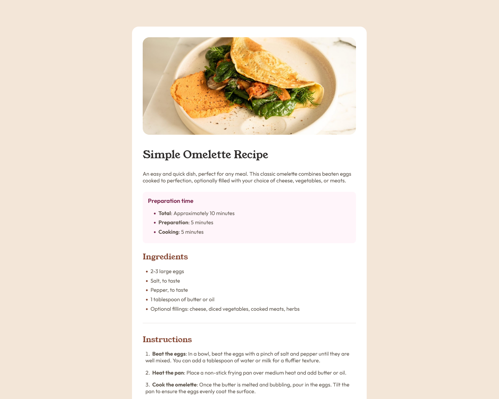

# Frontend Mentor - Recipe page solution

This is a solution to the [Recipe page challenge on Frontend Mentor](https://www.frontendmentor.io/challenges/recipe-page-KiTsR8QQKm). Frontend Mentor challenges help you improve your coding skills by building realistic projects. 

## Table of contents

- [Overview](#overview)
  - [Screenshot](#screenshot)
  - [Links](#links)
  - [Built with](#built-with)
- [Author](#author)

## Overview

### Screenshot

### Links

- Solution URL: [My solution](https://www.frontendmentor.io/solutions/recipe-page-HZAS2luP7F)
- Live Site URL: [live site URL](https://arturkobylianskyi.github.io/Recipe-page/)

### Built with

- Semantic HTML5 markup
- CSS custom properties
- Flexbox
- CSS Grid

## Author

- Website - [ArturKobylianskyi](https://github.com/Arturkobylianskyi)
- Frontend Mentor - [@Arturkobylianskyi](https://www.frontendmentor.io/profile/Arturkobylianskyi)
